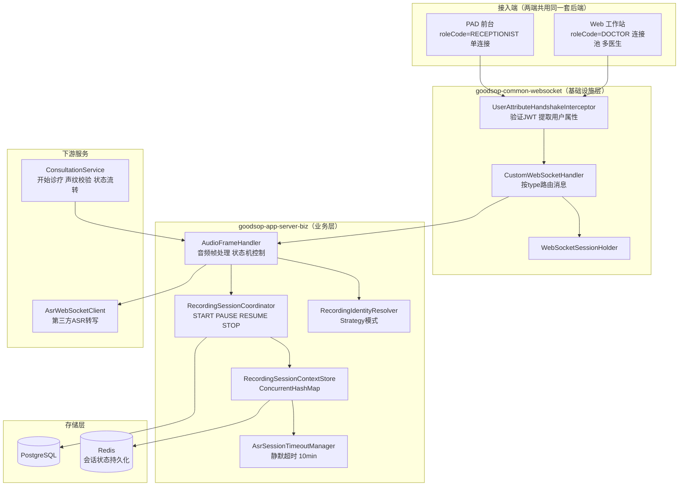
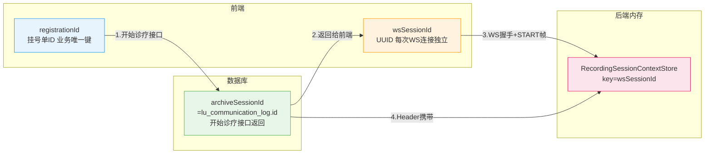
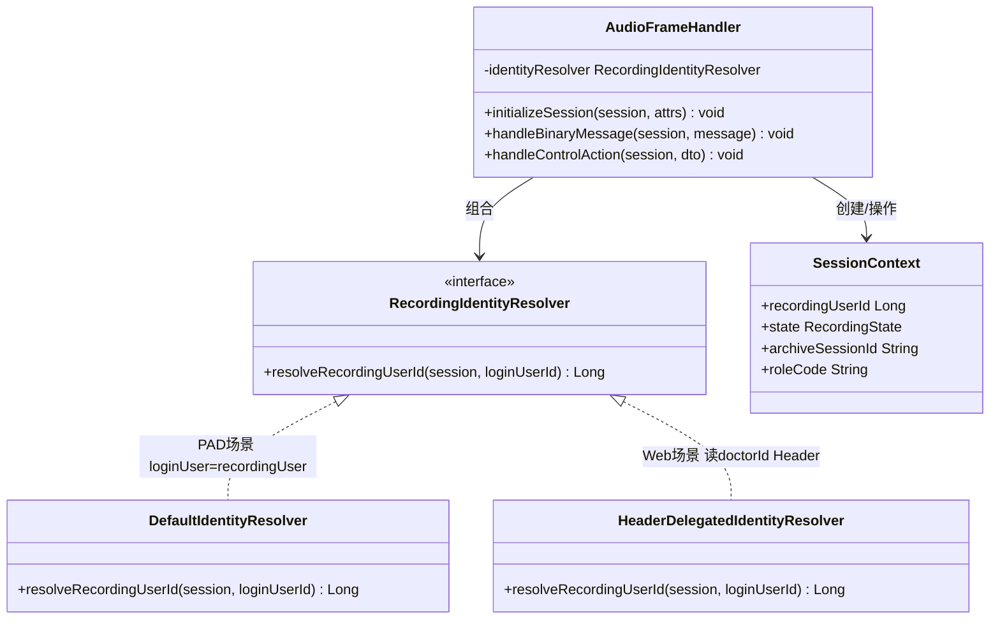

# v1.5 录音架构总览图

> 本文档为 `v1.5-详细设计.md` 第 9 章配套图示，呈现 PAD 与 Web 工作站共用后端录音架构的整体结构。
>
> 详细流程图见：
> - [v1.5-架构图-PAD录音.md](./v1.5-架构图-PAD录音.md)
> - [v1.5-架构图-Web录音.md](./v1.5-架构图-Web录音.md)

---

## 1. 整体架构分层图

---

## 2. Session ID 双层设计

| ID | 生命周期 | 职责 |
|----|---------|------|
| `registrationId` | 挂号单全程 | 前端连接池的索引键 |
| `wsSessionId` | 单次 WS 连接 | 后端内存路由键，隔离并发会话 |
| `archiveSessionId` | 诊疗全程（跨多次连接） | 数据库业务锚点，保证录音数据连续性 |

---

## 3. 身份解析策略类图

---

## 4. PAD vs Web 核心差异对比

| 维度 | PAD 前台录音 | Web 工作站录音 |
|------|-------------|--------------|
| 登录用户与录音归属 | 登录用户 = 录音归属人 | 登录用户（院长）≠ 录音归属人（医生） |
| 连接数 | 单条 WS 始终保持 | 连接池，多医生并发各一条 |
| roleCode | RECEPTIONIST | DOCTOR |
| 声纹校验 | 弱（可选） | 强（开始诊疗前必须通过） |
| 静默超时 | 可配置 | 10min 无帧自动收尾 |
| 身份解析器 | DefaultIdentityResolver | HeaderDelegatedIdentityResolver |
| 后端改动 | 无 | 仅新增 Resolver 实现 |
