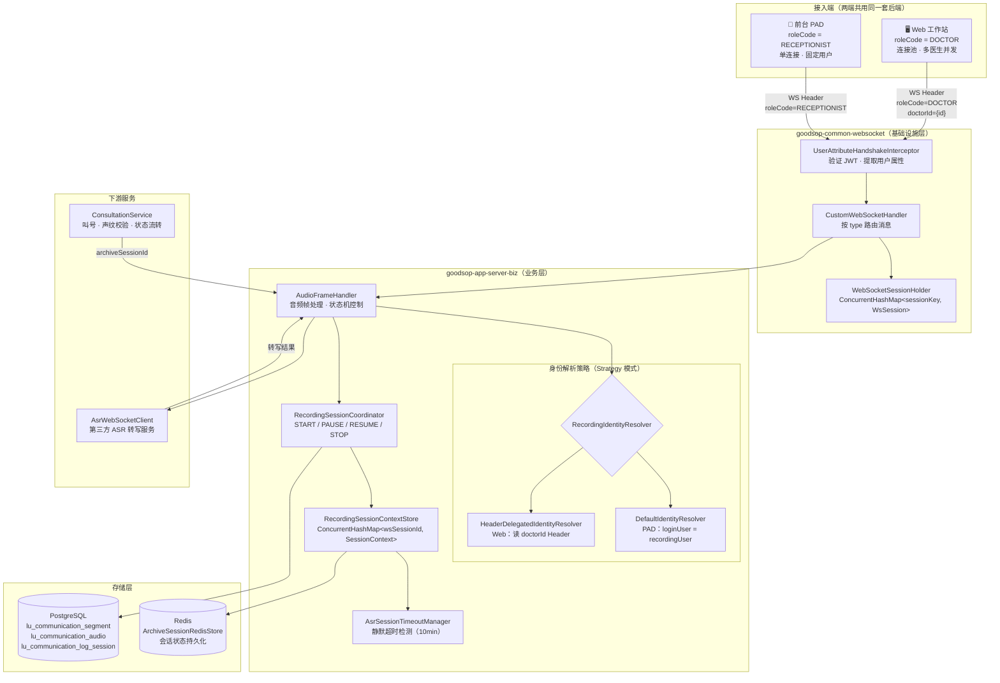
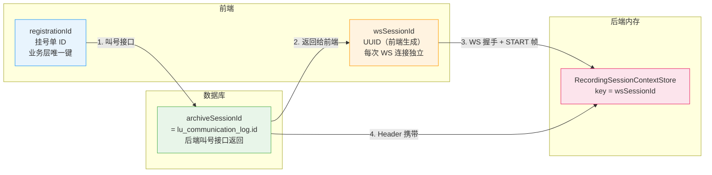
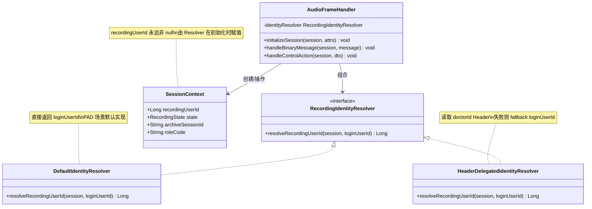
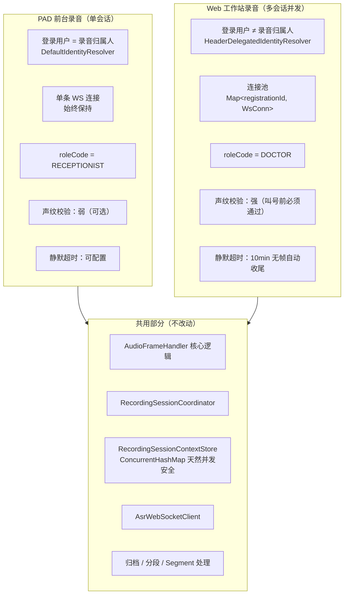

# v1.5 录音架构总览图

> PAD 与 Web 工作站共用后端录音架构的整体结构。
> 详细流程图见：[PAD 前台录音](./pad-recording.md) · [Web 工作站录音](./web-recording.md)

---

## 1. 整体架构分层图

---

## 2. Session ID 双层设计

| ID | 生命周期 | 职责 |
|----|---------|------|
| `registrationId` | 挂号单全程 | 前端连接池的索引键 |
| `wsSessionId` | 单次 WS 连接 | 后端内存路由键，隔离并发会话 |
| `archiveSessionId` | 诊疗全程（跨多次连接） | 数据库业务锚点，保证录音数据连续性 |

---

## 3. 身份解析策略类图

---

## 4. PAD vs Web 核心差异对比

