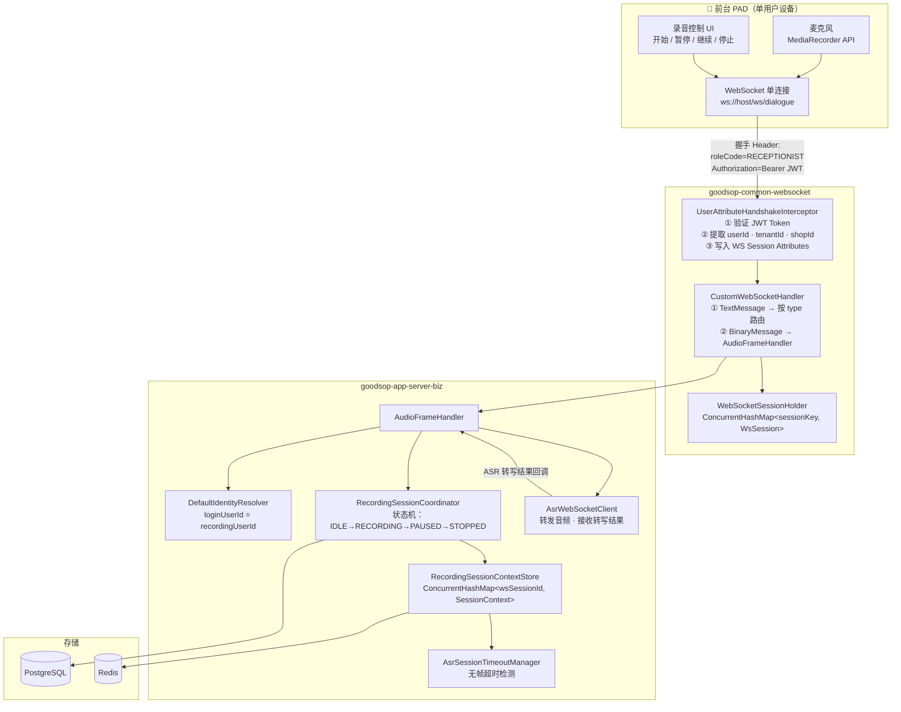
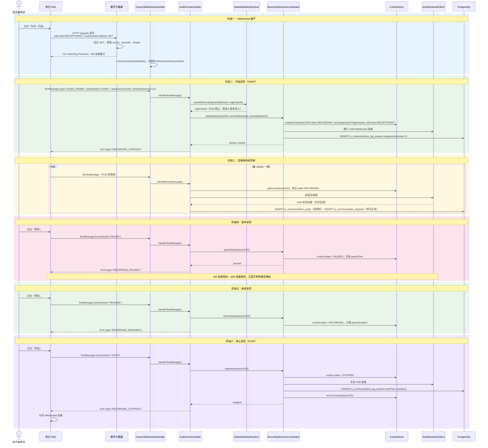
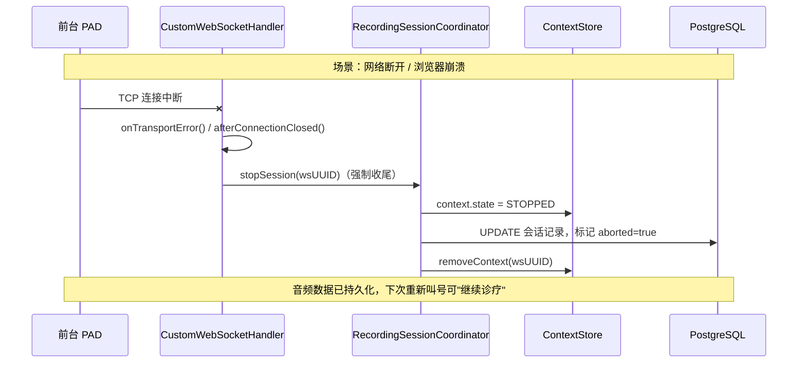
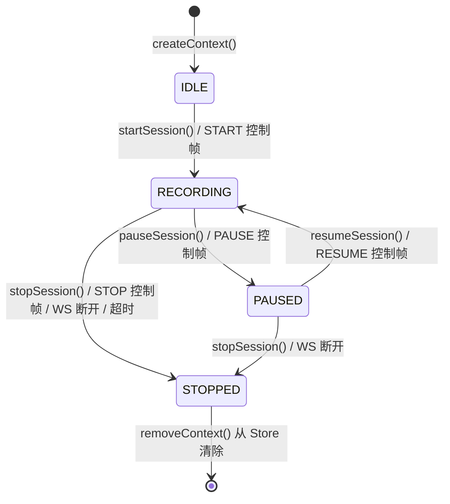

# v1.5 PAD 前台录音详细架构图

> PAD 端录音全链路详细图示。
> 返回总览：[overview.md](./overview.md)

---

## 1. 组件关系图

```mermaid
graph TD
    subgraph PAD["📱 前台 PAD（单用户设备）"]
        MIC["麦克风\nMediaRecorder API"]
        UI_PAD["录音控制 UI\n开始 / 暂停 / 继续 / 停止"]
        WS_PAD["WebSocket 单连接\nws://host/ws/dialogue"]
    end

    subgraph GW["goodsop-common-websocket"]
        Interceptor["UserAttributeHandshakeInterceptor\n① 验证 JWT Token\n② 提取 userId · tenantId · shopId\n③ 写入 WS Session Attributes"]
        Handler["CustomWebSocketHandler\n① TextMessage → 按 type 路由\n② BinaryMessage → AudioFrameHandler"]
        Holder["WebSocketSessionHolder\nConcurrentHashMap&lt;sessionKey, WsSession&gt;"]
    end

    subgraph BIZ["goodsop-app-server-biz"]
        AFH["AudioFrameHandler"]
        Resolver["DefaultIdentityResolver\nloginUserId = recordingUserId"]
        Coord["RecordingSessionCoordinator\n状态机：IDLE→RECORDING→PAUSED→STOPPED"]
        Store["RecordingSessionContextStore\nConcurrentHashMap&lt;wsSessionId, SessionContext&gt;"]
        ASR_CLI["AsrWebSocketClient\n转发音频 · 接收转写结果"]
        Timeout["AsrSessionTimeoutManager\n无帧超时检测"]
    end

    subgraph STORAGE["存储"]
        PG[("PostgreSQL")]
        REDIS[("Redis")]
    end

    MIC --> WS_PAD
    UI_PAD --> WS_PAD
    WS_PAD -- "握手 Header:\nroleCode=RECEPTIONIST\nAuthorization=Bearer JWT" --> Interceptor
    Interceptor --> Handler
    Handler --> Holder
    Handler --> AFH
    AFH --> Resolver
    AFH --> Coord
    Coord --> Store
    AFH --> ASR_CLI
    Store --> Timeout
    Coord --> PG
    Store --> REDIS
    ASR_CLI -- "ASR 转写结果回调" --> AFH
```

---

## 2. 完整录音时序图

```mermaid
sequenceDiagram
    actor 前台接待员
    participant PAD as 前台 PAD
    participant Interceptor as 握手拦截器
    participant Handler as CustomWebSocketHandler
    participant AFH as AudioFrameHandler
    participant Resolver as DefaultIdentityResolver
    participant Coord as RecordingSessionCoordinator
    participant Store as ContextStore
    participant ASR as AsrWebSocketClient
    participant DB as PostgreSQL

    rect rgb(232, 244, 253)
        Note over 前台接待员,DB: 阶段一：WebSocket 握手
        前台接待员 ->> PAD: 点击「叫号 / 开始」
        PAD ->> Interceptor: HTTP Upgrade 请求<br/>roleCode=RECEPTIONIST / Authorization=Bearer JWT
        Interceptor ->> Interceptor: 验证 JWT，提取 userId、tenantId、shopId
        Interceptor -->> PAD: 101 Switching Protocols，WS 连接建立
        Handler ->> Handler: onConnectionEstablished()，注册到 WebSocketSessionHolder
    end

    rect rgb(232, 245, 232)
        Note over 前台接待员,DB: 阶段二：开始录音（START）
        PAD ->> Handler: TextMessage {type:"AUDIO_FRAME", controlAction:"START", sessionId:wsUUID, archiveSessionId:xxx}
        Handler ->> AFH: handleTextMessage()
        AFH ->> Resolver: resolveRecordingUserId(session, loginUserId)
        Resolver -->> AFH: loginUserId（PAD 默认：登录人即录音人）
        AFH ->> Coord: startSession(wsUUID, archiveSessionId, recordingUserId)
        Coord ->> Store: createContext(wsUUID) state=RECORDING, recordingUserId=loginUserId, roleCode=RECEPTIONIST
        Coord ->> ASR: 建立 ASR WebSocket 连接
        Coord ->> DB: INSERT lu_communication_log_session (sequenceNumber=1)
        Coord -->> AFH: session started
        AFH -->> PAD: ACK {type:"RECORDING_STARTED"}
    end

    rect rgb(255, 248, 225)
        Note over 前台接待员,DB: 阶段三：音频帧持续传输
        loop 每 100ms 一帧
            PAD ->> Handler: BinaryMessage（PCM 音频帧）
            Handler ->> AFH: handleBinaryMessage()
            AFH ->> Store: getContext(wsUUID)，验证 state=RECORDING
            AFH ->> ASR: 转发音频帧
            ASR -->> AFH: ASR 转写结果（异步回调）
            AFH ->> DB: INSERT lu_communication_audio（音频帧）/ INSERT lu_communication_segment（转写文本）
        end
    end

    rect rgb(252, 228, 236)
        Note over 前台接待员,DB: 阶段四：暂停录音
        前台接待员 ->> PAD: 点击「暂停」
        PAD ->> Handler: TextMessage {controlAction:"PAUSE"}
        Handler ->> AFH: handleTextMessage()
        AFH ->> Coord: pauseSession(wsUUID)
        Coord ->> Store: context.state = PAUSED，记录 pauseTime
        Coord -->> AFH: paused
        AFH -->> PAD: ACK {type:"RECORDING_PAUSED"}
        Note over PAD,ASR: WS 连接保持，ASR 连接保持，只是不再传输音频帧
    end

    rect rgb(232, 245, 232)
        Note over 前台接待员,DB: 阶段五：继续录音
        前台接待员 ->> PAD: 点击「继续」
        PAD ->> Handler: TextMessage {controlAction:"RESUME"}
        Handler ->> AFH: handleTextMessage()
        AFH ->> Coord: resumeSession(wsUUID)
        Coord ->> Store: context.state = RECORDING，计算 pauseDuration
        AFH -->> PAD: ACK {type:"RECORDING_RESUMED"}
    end

    rect rgb(240, 232, 255)
        Note over 前台接待员,DB: 阶段六：停止录音（STOP）
        前台接待员 ->> PAD: 点击「完成」
        PAD ->> Handler: TextMessage {controlAction:"STOP"}
        Handler ->> AFH: handleTextMessage()
        AFH ->> Coord: stopSession(wsUUID)
        Coord ->> Store: context.state = STOPPED
        Coord ->> ASR: 关闭 ASR 连接
        Coord ->> DB: UPDATE lu_communication_log_session (endTime, duration)
        Coord ->> Store: removeContext(wsUUID)
        Coord -->> AFH: stopped
        AFH -->> PAD: ACK {type:"RECORDING_STOPPED"}
        PAD ->> PAD: 关闭 WebSocket 连接
    end
```

---

## 3. 异常场景：WS 意外断开

```mermaid
sequenceDiagram
    participant PAD as 前台 PAD
    participant Handler as CustomWebSocketHandler
    participant Coord as RecordingSessionCoordinator
    participant Store as ContextStore
    participant DB as PostgreSQL

    Note over PAD,DB: 场景：网络断开 / 浏览器崩溃
    PAD -x Handler: TCP 连接中断
    Handler ->> Handler: onTransportError() / afterConnectionClosed()
    Handler ->> Coord: stopSession(wsUUID)（强制收尾）
    Coord ->> Store: context.state = STOPPED
    Coord ->> DB: UPDATE 会话记录，标记 aborted=true
    Coord ->> Store: removeContext(wsUUID)
    Note over PAD,DB: 音频数据已持久化，下次重新叫号可"继续诊疗"
```

---

## 4. SessionContext 状态机

```mermaid
stateDiagram-v2
    [*] --> IDLE : createContext()

    IDLE --> RECORDING : startSession() / START 控制帧

    RECORDING --> PAUSED : pauseSession() / PAUSE 控制帧

    PAUSED --> RECORDING : resumeSession() / RESUME 控制帧

    RECORDING --> STOPPED : stopSession() / STOP 控制帧 / WS 断开 / 超时

    PAUSED --> STOPPED : stopSession() / WS 断开

    STOPPED --> [*] : removeContext() 从 Store 清除
```
