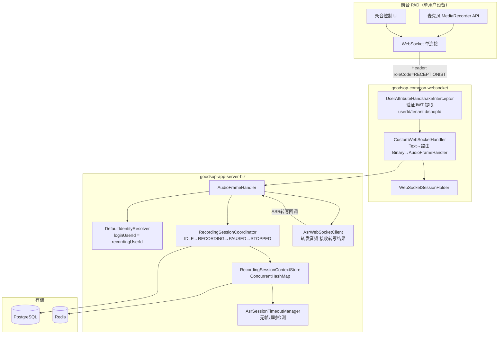
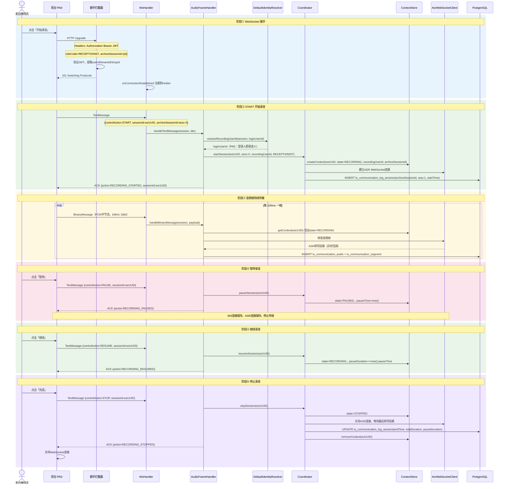
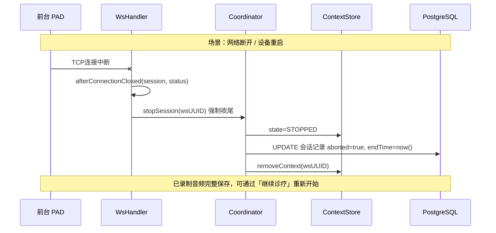
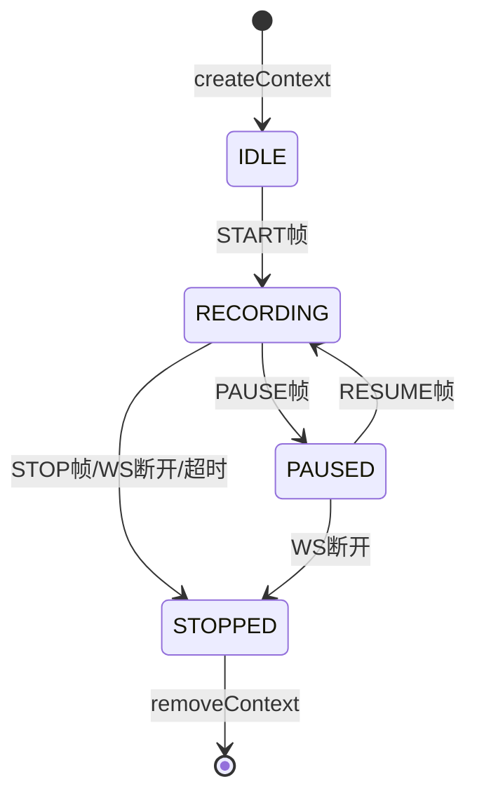

# v1.5 PAD 前台录音详细架构图

> 本文档为 `v1.5-详细设计.md` 第 9 章配套图示 —— PAD 端录音全链路。
> 返回总览：[v1.5-架构图-总览.md](./v1.5-架构图-总览.md)

---

## 1. 组件关系图



---

## 2. 关键接口入参说明

### 2.1 WS 握手 Headers（PAD 端）

| Header 字段 | 类型 | 必填 | 说明 |
|------------|------|------|------|
| `Authorization` | String | ✅ | `Bearer {JWT}` 登录 token |
| `roleCode` | String | ✅ | 固定值 `RECEPTIONIST` |
| `archiveSessionId` | String | ✅ | 来自挂号/诊疗管理接口，关联诊疗全程数据 |
| `tenantId` | Long | ✅ | 租户 ID（Interceptor 从 JWT 提取） |
| `shopId` | Long | ✅ | 门店 ID（Interceptor 从 JWT 提取） |

> **注意**：PAD 前台**没有叫号动作**。`archiveSessionId` 由前台通过查询当前诊疗状态或接收事件通知获得，在「开始录音」前必须已拿到该值。

### 2.2 控制帧 TextMessage（前端 → 后端）

```json
{
  "controlAction": "START | PAUSE | RESUME | STOP",
  "sessionId": "uuid-v4（前端每次连接时生成，作为 wsSessionId）",
  "archiveSessionId": "来自握手 Header，冗余携带用于校验"
}
```

| 字段 | 类型 | 必填 | 说明 |
|------|------|------|------|
| `controlAction` | Enum | ✅ | `START` / `PAUSE` / `RESUME` / `STOP` |
| `sessionId` | String(UUID) | ✅ | wsSessionId，后端 ContextStore 的路由 key |
| `archiveSessionId` | String | ✅（START） | 仅 START 帧必填，其他帧可省略 |

### 2.3 音频帧 BinaryMessage（前端 → 后端）

| 内容 | 说明 |
|------|------|
| 消息体 | 原始 PCM 音频字节流（16kHz 16bit 单声道） |
| 路由方式 | 后端通过 WS Session 对象查找对应 wsSessionId，无需额外字段 |
| 发送频率 | 每 100ms 一帧 |

### 2.4 后端核心方法签名

| 方法 | 入参 | 说明 |
|------|------|------|
| `startSession(wsSessionId, archiveSessionId, recordingUserId, roleCode)` | String, String, Long, String | 创建 SessionContext，建立 ASR 连接 |
| `pauseSession(wsSessionId)` | String | state → PAUSED，记录 pauseTime |
| `resumeSession(wsSessionId)` | String | state → RECORDING，累计 pauseDuration |
| `stopSession(wsSessionId)` | String | 归档，关闭 ASR，清除 Context |
| `createContext(wsSessionId, ...)` | SessionContext 入参 | 写入 ConcurrentHashMap + Redis |

---

## 3. 完整录音时序图

### 阶段说明

| 阶段 | 触发动作 | 核心操作 |
|------|---------|---------|
| ① 握手 | 点击「开始录音」 | HTTP Upgrade → WS 连接建立 |
| ② START | 发送 START 控制帧 | 创建 SessionContext，建立 ASR 连接 |
| ③ 传帧 | 持续采集音频 | 每 100ms 一帧，ASR 实时转写 |
| ④ PAUSE | 点击「暂停」 | state → PAUSED，WS/ASR 保持 |
| ⑤ RESUME | 点击「继续」 | state → RECORDING |
| ⑥ STOP | 点击「完成」 | 关闭 ASR，归档，关闭 WS |



---

## 4. 异常场景：WS 意外断开



---

## 5. SessionContext 状态机



| 状态转换 | 触发条件 | 后续动作 |
|---------|---------|---------|
| IDLE → RECORDING | START 控制帧 | 创建 ASR 连接，写 DB session |
| RECORDING → PAUSED | PAUSE 控制帧 | 停止传帧，WS/ASR 保持 |
| PAUSED → RECORDING | RESUME 控制帧 | 继续传帧，累计 pauseDuration |
| RECORDING → STOPPED | STOP / WS 断开 / 超时 | 关闭 ASR，归档 DB，清除 Context |
| PAUSED → STOPPED | WS 断开 | 同上 |
