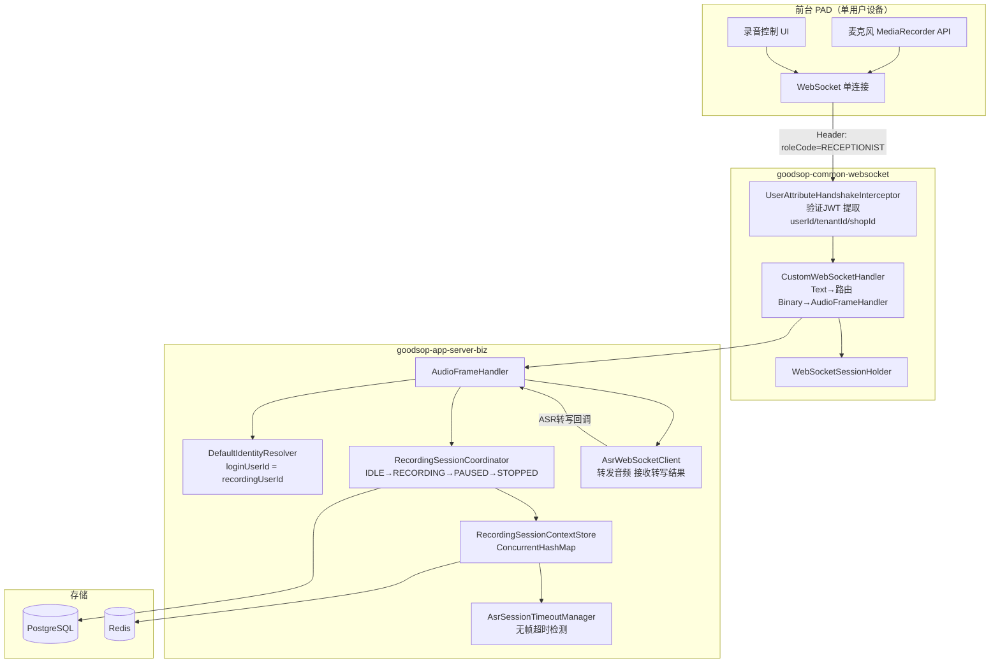
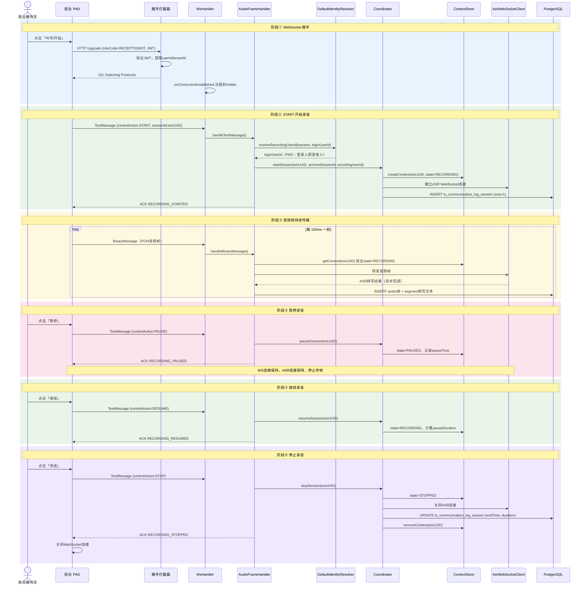
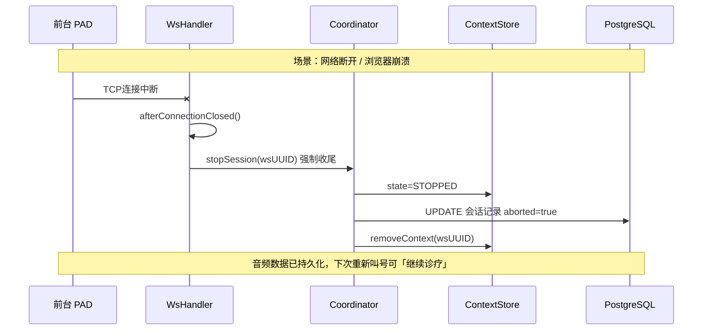
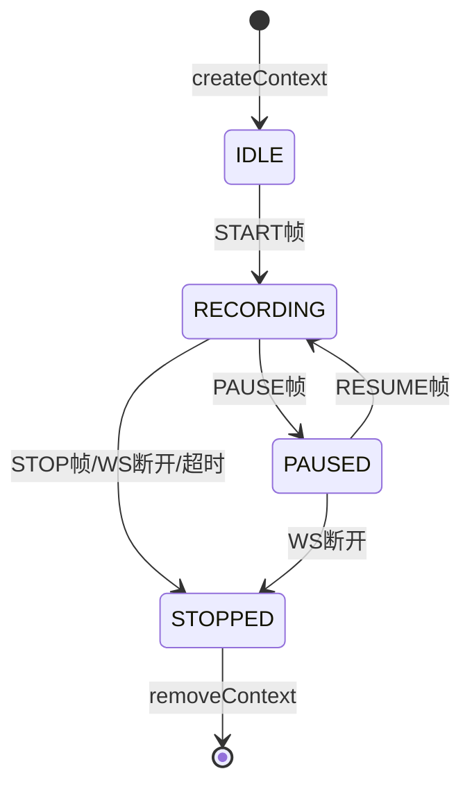

# v1.5 PAD 前台录音详细架构图

> 本文档为 `v1.5-详细设计.md` 第 9 章配套图示 —— PAD 端录音全链路。
> 返回总览：[v1.5-架构图-总览.md](./v1.5-架构图-总览.md)

---

## 1. 组件关系图

---

## 2. 完整录音时序图

### 阶段说明

| 阶段 | 触发动作 | 核心操作 |
|------|---------|---------|
| ① 握手 | 点击「叫号/开始」 | HTTP Upgrade → WS 连接建立 |
| ② START | 发送 START 控制帧 | 创建 SessionContext，建立 ASR 连接 |
| ③ 传帧 | 持续采集音频 | 每 100ms 一帧，ASR 实时转写 |
| ④ PAUSE | 点击「暂停」 | state → PAUSED，WS/ASR 保持 |
| ⑤ RESUME | 点击「继续」 | state → RECORDING |
| ⑥ STOP | 点击「完成」 | 关闭 ASR，归档，关闭 WS |

---

## 3. 异常场景：WS 意外断开

---

## 4. SessionContext 状态机

| 状态转换 | 触发条件 | 后续动作 |
|---------|---------|---------|
| IDLE → RECORDING | START 控制帧 | 创建 ASR 连接，写 DB session |
| RECORDING → PAUSED | PAUSE 控制帧 | 停止传帧，WS/ASR 保持 |
| PAUSED → RECORDING | RESUME 控制帧 | 继续传帧，累计 pauseDuration |
| RECORDING → STOPPED | STOP / WS 断开 / 超时 | 关闭 ASR，归档 DB，清除 Context |
| PAUSED → STOPPED | WS 断开 | 同上 |
