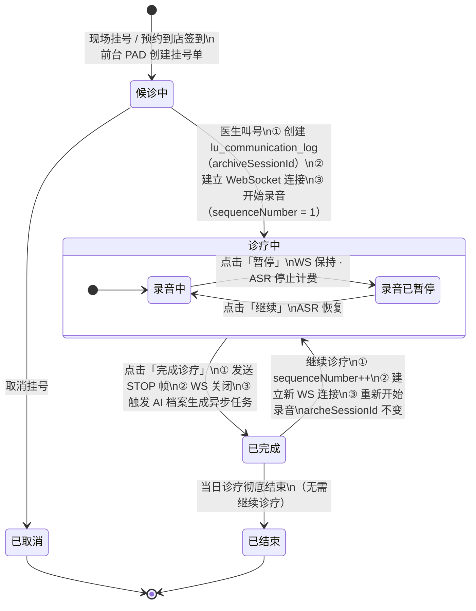
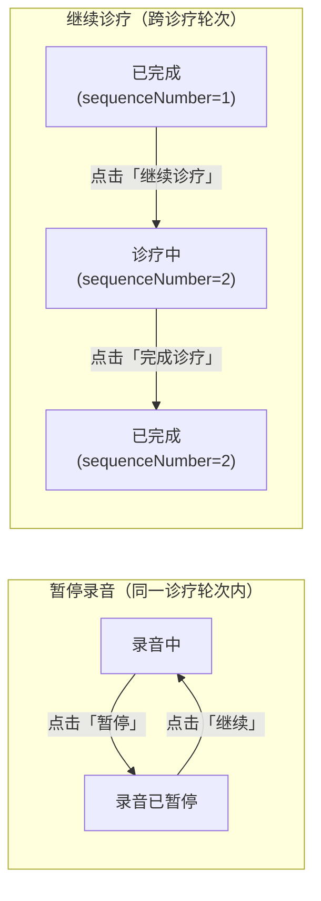

# 挂号单逻辑状态迁移图

> 覆盖从挂号到诊疗结束的完整业务状态流转，包含录音子状态。
> 返回系列索引：[README.md](./README.md)

---

## 1. 挂号单完整状态机

---

## 2. 关键节点说明

| 状态 | 对应数据变化 | 触发端 |
|------|------------|--------|
| **候诊中** | `tb_registration.status = WAITING` | 前台 PAD 挂号 / 预约到店 |
| **诊疗中（录音中）** | 创建 `lu_communication_log`，`lu_communication_log_session`（sequenceNumber=N），WS 连接建立 | Web 工作站医生叫号 |
| **诊疗中（录音已暂停）** | `SessionContext.state = PAUSED`，同步写 Redis | Web 工作站点击暂停 |
| **已完成** | `tb_registration.status = COMPLETED`，`SessionContext` 进入 STOPPED，触发档案生成 | Web 工作站完成诊疗 |
| **继续诊疗** | 新增 `lu_communication_log_session`（sequenceNumber+1），archiveSessionId **不变** | Web 工作站继续诊疗 |
| **已结束** | `tb_registration.status = CLOSED` | 当日结束 / 手动关闭 |
| **已取消** | `tb_registration.status = CANCELLED` | 前台 PAD 或系统端取消 |

---

## 3. 继续诊疗与暂停录音的区别

| 维度 | 暂停录音 | 继续诊疗 |
|------|---------|---------|
| WS 连接 | 保持不断 | 关闭旧连接，建立新连接 |
| archiveSessionId | 不变 | 不变 |
| sequenceNumber | 不变 | +1 |
| ASR 连接 | 保持（停止计费） | 关闭后重新建立 |
| 挂号单状态 | 诊疗中（不变） | 已完成 → 诊疗中 |
| Redis active key | 不变 | 旧 key 删除，写入新 wsSessionId |
