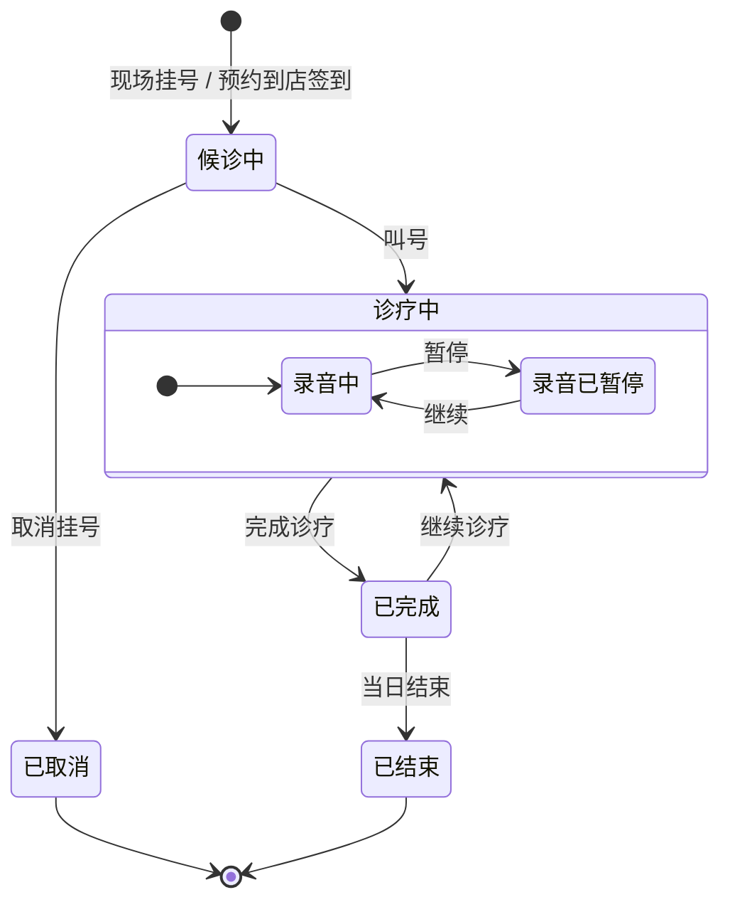
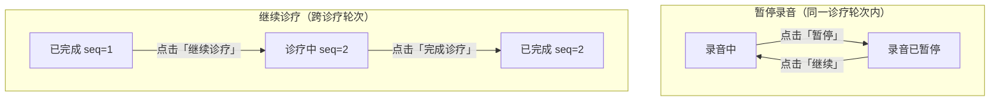

# 挂号单逻辑状态迁移图

> 覆盖从挂号到诊疗结束的完整业务状态流转，包含录音子状态。
> 返回系列索引：[README.md](./README.md)

---

## 1. 挂号单完整状态机

---

## 2. 关键转换说明

| 转换 | 触发操作 | 数据变化 | 触发端 |
|------|---------|---------|--------|
| `[*] → 候诊中` | 现场挂号 / 预约到店 | 创建 `tb_registration`，status = WAITING | 前台 PAD |
| `候诊中 → 诊疗中` | 医生叫号 | 创建 `lu_communication_log`（archiveSessionId），建立 WS 连接，开始录音（sequenceNumber = 1） | Web 工作站 |
| `录音中 → 录音已暂停` | 点击「暂停」 | SessionContext.state = PAUSED，同步写 Redis，WS 保持，ASR 停止 | Web 工作站 |
| `录音已暂停 → 录音中` | 点击「继续」 | SessionContext.state = RECORDING，ASR 恢复 | Web 工作站 |
| `诊疗中 → 已完成` | 点击「完成诊疗」 | 发送 STOP 帧，WS 关闭，status = COMPLETED，触发 AI 档案异步生成 | Web 工作站 |
| `已完成 → 诊疗中` | 点击「继续诊疗」 | sequenceNumber++，建立新 WS 连接，开始新一轮录音，archiveSessionId 不变 | Web 工作站 |
| `已完成 → 已结束` | 当日诊疗彻底结束 | status = CLOSED | Web 工作站 / 系统 |
| `候诊中 → 已取消` | 取消挂号 | status = CANCELLED | 前台 PAD / 系统端 |

---

## 3. 暂停录音 vs 继续诊疗

两个容易混淆的概念，本质是不同层次的操作：

| 维度 | 暂停录音 | 继续诊疗 |
|------|---------|---------|
| WS 连接 | 保持不断 | 关闭旧连接，建立新连接 |
| archiveSessionId | 不变 | 不变 |
| sequenceNumber | 不变 | +1 |
| ASR 连接 | 保持（停止计费） | 关闭后重建 |
| 挂号单状态 | 诊疗中（不变） | 已完成 → 诊疗中 |
| Redis active key | 不变 | 删除旧 key，写入新 wsSessionId |
