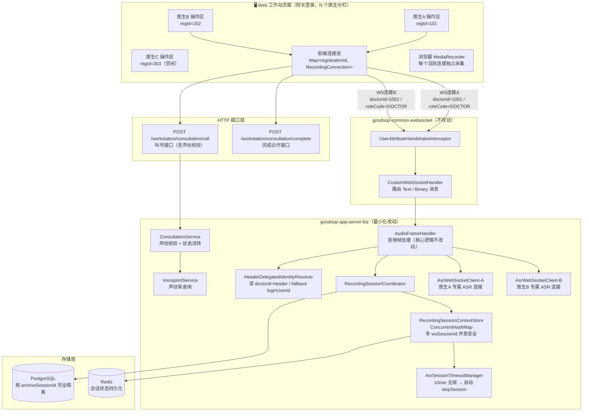
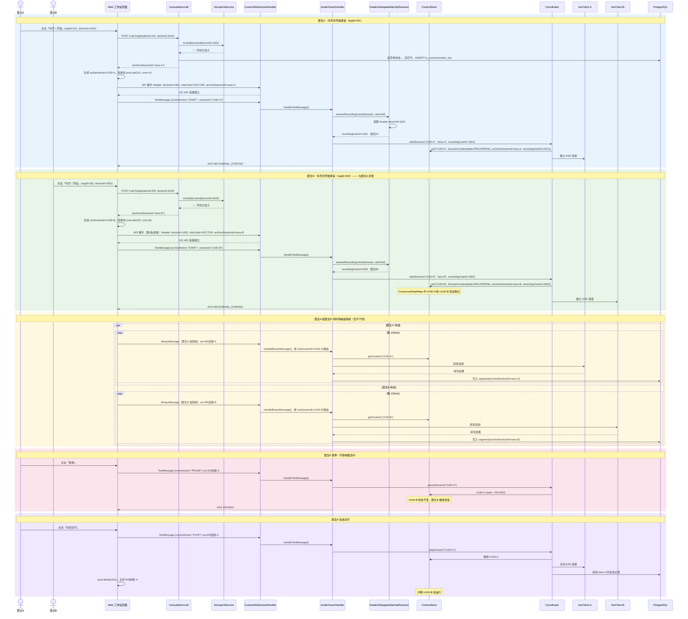
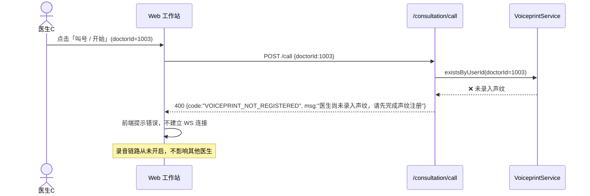
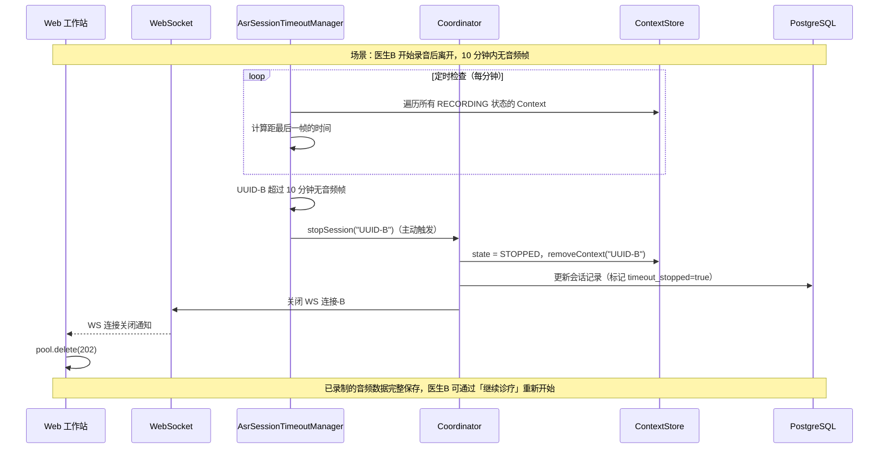
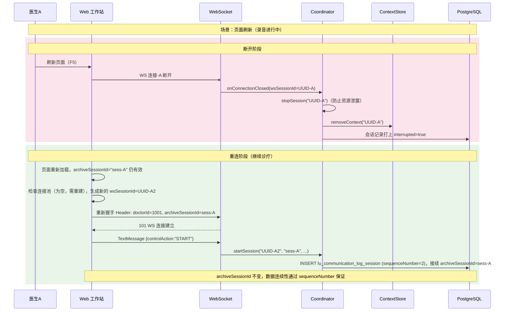
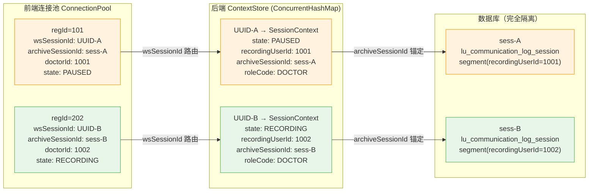

# v1.5 Web 工作站多医生并发录音详细架构图

> Web 工作站多医生并发录音全链路详细图示。
> 返回总览：[overview.md](./overview.md)

---

## 1. 组件关系图

---

## 2. 多医生并发录音时序图

---

## 3. 声纹校验失败流程

---

## 4. 静默超时自动收尾流程

---

## 5. 页面刷新 / 断线重连流程

---

## 6. 内存状态快照（并发中间态）

