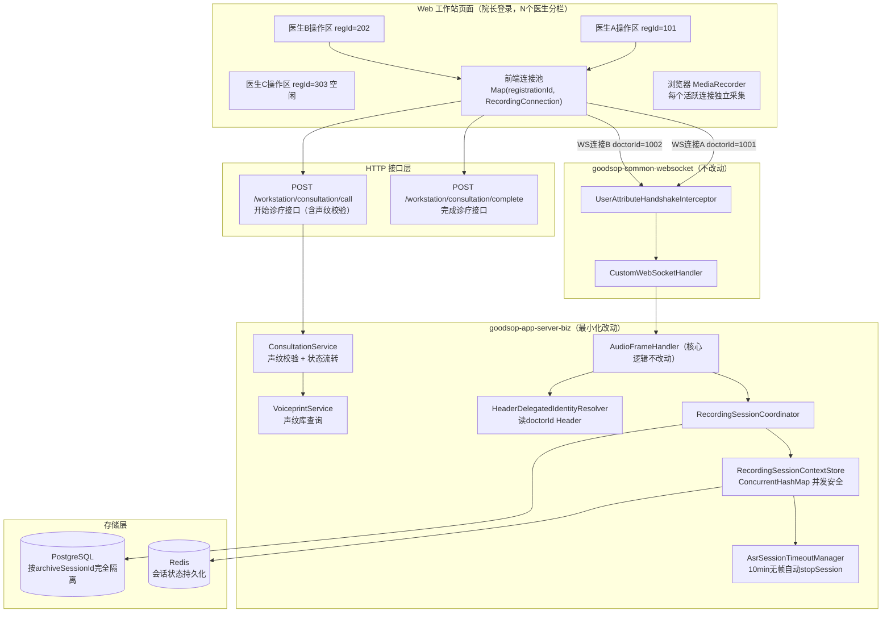
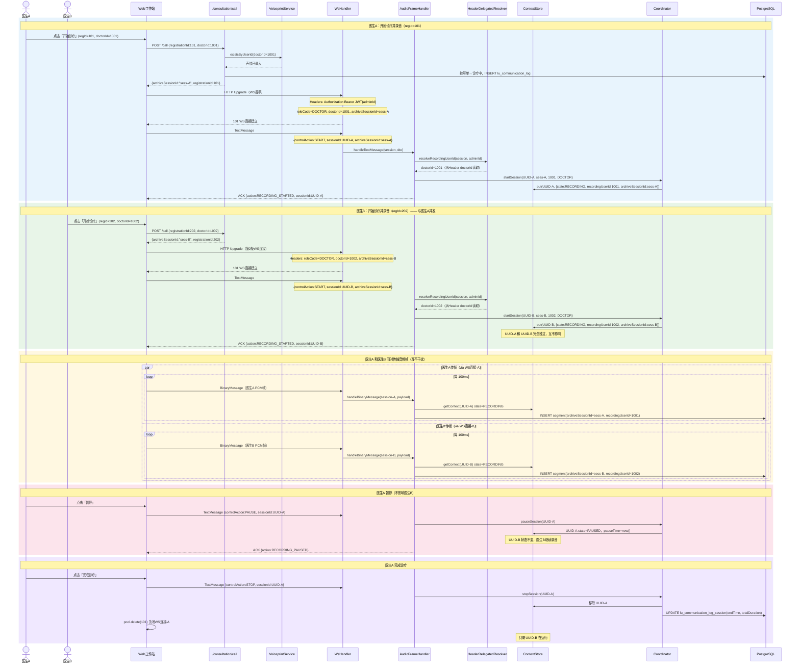
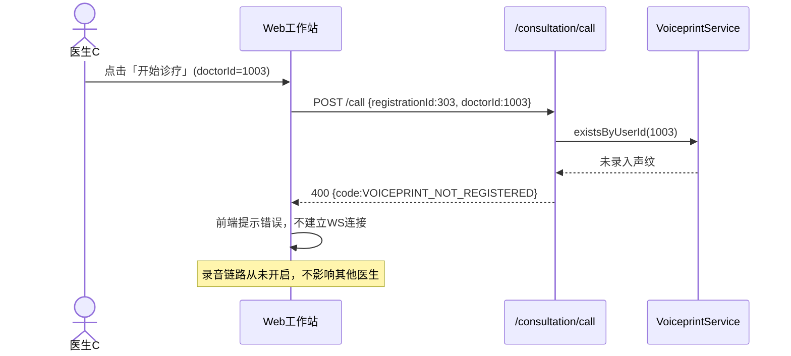
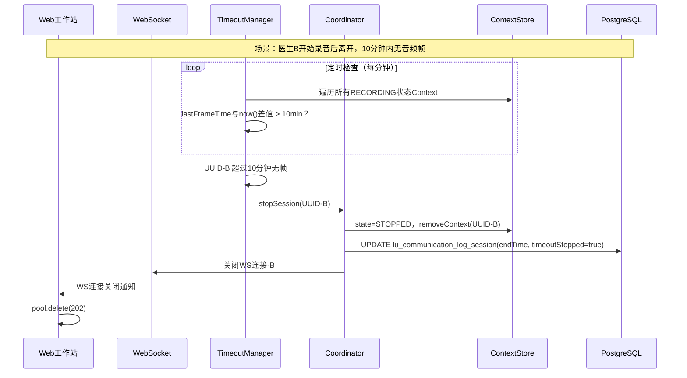
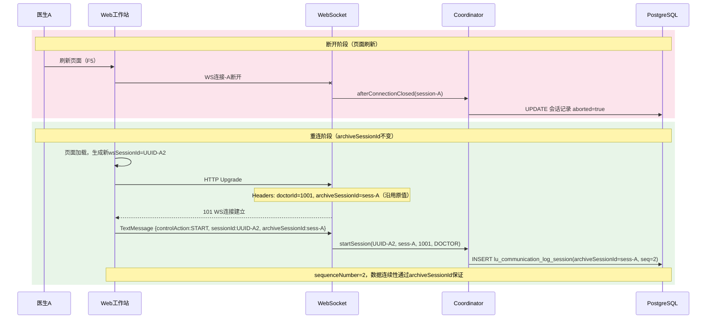
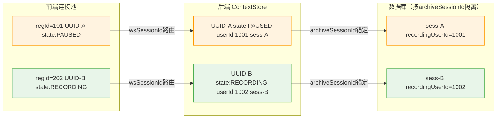

# v1.5 Web 工作站多医生并发录音架构图

> 配套详细设计：[v1.5-详细设计.md](./v1.5-详细设计.md) · 总览：[v1.5-架构图-总览.md](./v1.5-架构图-总览.md)

---

## 1. 组件关系图

---

## 2. 多医生并发录音时序图

> 院长登录，N 个医生各自独立操作，每人一条 WS 连接，互不干扰。

---

## 3. 声纹校验失败流程

---

## 4. 静默超时自动收尾

---

## 5. 断线重连流程

---

## 6. 内存状态快照（并发中间态）

